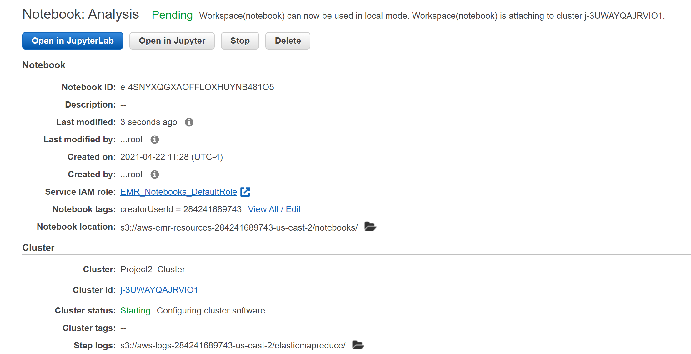
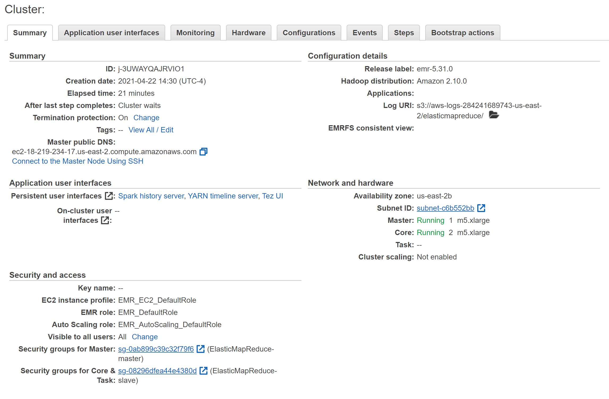

# Project02
## Project Description
This project utilizes latest AWS Cloud tools and Apache Spark to perform data analysis on about 10Gb of Yelp data. From the technical aspect, the objective of this project is to leverage the computing power and cloud storage tool provided by AWS to write queries and process data via Apache Spark. By using these technologies which catered to Big Data tasks, analysis on large volume of data can be done in a quicker manner.
***

## Technology Used
* S3 for storage
* AWS EMR Cluster
* Apache Spark 2.4.6
* Hadoop 2.10.0
* Hive 2.3.7
* Hue 4.7.1
* Pig 0.17.0
* Livy 0.7.0

## Data Files Include

1. yelp_academic_dataset_business.json
2. yelp_academic_dataset_review.json
3. yelp_academic_dataset_user.json 
[Data Source](https://www.kaggle.com/yelp-dataset/yelp-dataset#yelp_academic_dataset_user.json)
***
## Jupyter Notebook Configuration Screenshot

[Notebook Image](Asset/Notebook.PNG)

## Cluster Configuration Screenshot

[Cluster Image](Asset/Notebook.PNG)

***
